# alexa-tv-remote

This is a simple fun project to send commands to your TV using a standard
Alexa skill. Once created, Alexa will invoke your Lambda function, which
will interpret your response and publish the required command into an
AWS IOT topic. The Raspberry Pi (RPi) subscribes to this topic and coverts
the received messages into IR pulses for your TV to interpret.

The Alexa Skill Kit also has a Video skill, which provides a fixed set
of phrases and requires OAuth in order to bind to your device, feel free
to use this skill as a starting point if you want to go down this route!

Further improvements to this skill could be as follows:
- Improve the voice interface to make it less clunky
- Allow the user to show the EPG and scroll
- Allow the user to change the input mode (ex. HDMI1, DVI)
- Allow the user to ask for a programme, it would be expected that the
 correct channel would be found or a schedule/reminder could be set. 

_TODO: Video of the skill working_

## Finding your way round

Below is a breakdown of the folders and files of this project, each is explained more within
this README.md file.

```
alexa
 - ask.json (Intent document for the Alexa skill configuration)
lambda
 - lambda.py (Lambda Skill which is invoked by the Alexa Skill Service)
 - resources.yaml (CloudFormation template to setup deployment resources and IOT policies)
 - serverless.yml (Serverless Framework configuration for deploying the Lambda function)
 - serverless.env.yml (Serverless Framework environmental file, you will need to edit this file)
rpi
 - rpi.py (RPI python script, you will need LIRC and AWSIoTPythonSDK to use this)
```

### Alexa

The Alexa folder contains the skill configuration required for interacting
with the Lambda function. This skill configuration will be uploaded during
the Alexa skill creation.

### Lambda

The Lambda folder contains all the files needed to setup a Lambda 
function and the necessary IAM roles and policies needed for the service
to function correctly and make deployments easy.

### RPi

The RPi folder contains the python script which receives messages from
AWS IOT and sends them to the [LIRC](http://www.lirc.org/) daemon, 
causing an Infra-Red LED to be activated as required to send information 
to the TV.


## Getting started

### Prerequites

Git clone this repository onto your computer, you will need the files
in order to deploy them into AWS and your RaspberryPi.

`git clone https://github.com/martysweet/alexa-tv-remote.git`

### Lambda

To get started, you need an AWS account. If you don't already have one,
you can signup at https://aws.amazon.com/free. 

Once you have logged in, you will need to deploy the `resources.yaml` 
template via [Cloudformation](https://eu-west-1.console.aws.amazon.com/cloudformation/home?region=eu-west-1#/stacks?filter=active)
in your desired region. In this example, we will use `eu-west-1`.

1. Create New Stack
2. Upload the `lambda/resources.yaml` file
3. Name the stack `alexa-tv-remote`
4. Click next a few times
5. Check 'I acknowledge that AWS CloudFormation might create IAM resources.'
6. Click Create

You can see the following resources which have been created by looking
at the 'Outputs' section.

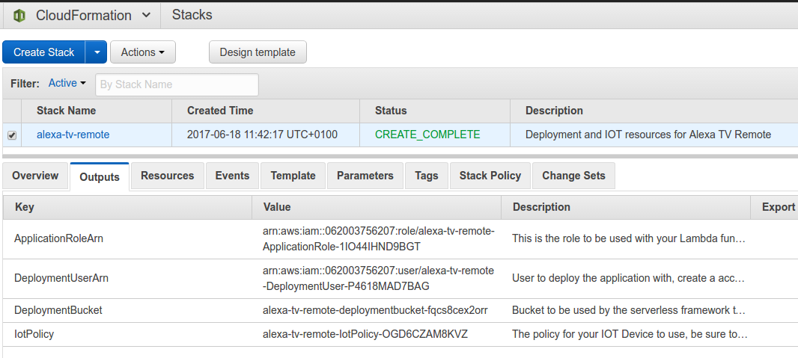

For reference, we have the following resources created:
- arn:aws:iam::062003756207:role/alexa-tv-remote-ApplicationRole-1IO44IHND9BGT
- arn:aws:iam::062003756207:user/alexa-tv-remote-DeploymentUser-P4618MAD7BAG
- alexa-tv-remote-deploymentbucket-fqcs8cex2orr	
- alexa-tv-remote-IotPolicy-OGD6CZAM8KVZ	


Next we need to setup access keys for our deployment user.
Navigate to [IAM](https://console.aws.amazon.com/iam/home/) in 
the AWS Console, click on 'Users' and locate your created 
`alexa-tv-remote-DeploymentUser`. Click on the user, click on the 
'Security Credentials' tab and finally click 'Create Access Key'.

Copy the Access key ID and Secret access key to somewhere, like a notepad.
You should treat these keys as private, anyone with access to them will have
access into your AWS account!

Once you have created an access key, your IAM user should look similar to
this.

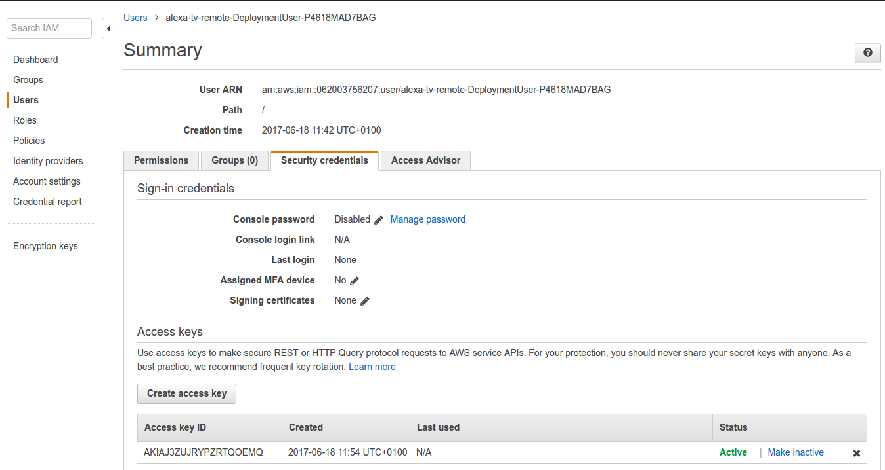

Once the deployment user has active access keys, we are going to create 
we need to setup our [AWS CLI command line tool](http://docs.aws.amazon.com/cli/latest/userguide/installing.html).

First, ensure you have the AWS CLI installed then run the below command
to configure the Access Keys and Secret Key into a profile called `alexa-tv-remote`.

```
$ aws configure --profile alexa-tv-remote
AWS Access Key ID [None]: MYACCESSKEYIJUSTCREATED
AWS Secret Access Key [None]: MYSECRETKEYIJUSTCREATED
Default region name [eu-west-1]: eu-west-1
Default output format [json]: json
```


Great! Next, ensure you have the serverless framework installed by 
following [this guide](https://serverless.com/framework/docs/providers/aws/guide/installation/).

Now we can use the serverless framework to deploy our Lambda function
using the deployment user we created above. Within this project, make 
sure you are working in the `lambda` directory.

```
$ cd lambda
$ pwd
/your/dev/path/alexa-tv-remote/lambda
```

Update the `serverless.env.yml` file with the outputs of the CloudFormation 
template we created earlier.


Now, lets deploy with serverless!
`$ serverless deploy --stage prod`

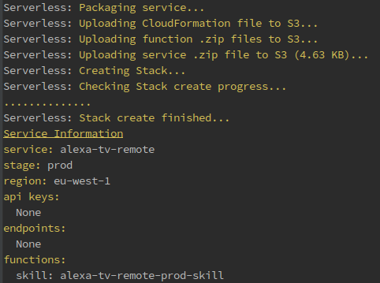

If that worked, you should see a [Lambda](https://eu-west-1.console.aws.amazon.com/lambda/home) 
function within the AWS Console. This function will be triggered by the 
Alexa service when a user asks Alexa for the skill.

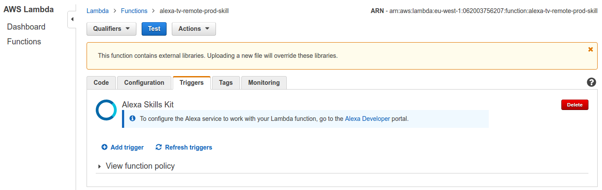

Take a note of your Lambda Amazon Resource Name (ARN), you will need this later.
In our example, the ARN is:
- arn:aws:lambda:eu-west-1:062003756207:function:alexa-tv-remote-prod-skill

### AWS IOT

The next step is to setup your AWS IOT device, and download the certificates
which your RaspberryPi will use to authenticate itself with the service.

The Lambda function we setup above will use the IOT service to send messages
in real time your the RaspberryPi, which will use the messages to control
the IR LED.

First, go to the [AWS IOT](https://eu-west-1.console.aws.amazon.com/iotv2/home) 
service within the AWS Console. If you are a new user, you may need to 
click 'Get Started'. From there, click 'Registry' then 'Things'.

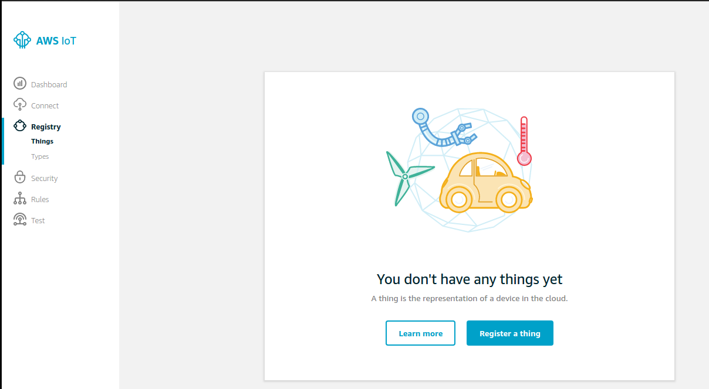

We are going to name the thing `alexa-tv-remote-thing`.

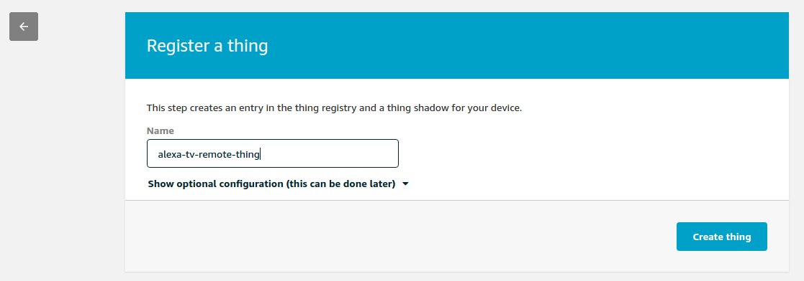

Click 'Create Thing', then click on 'Security'. 

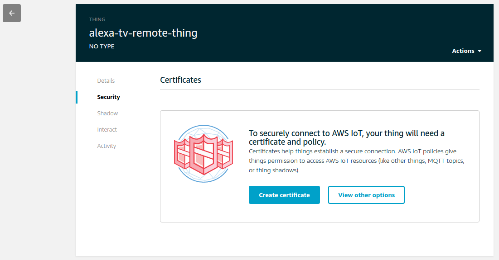

Click 'Create Certificate'.

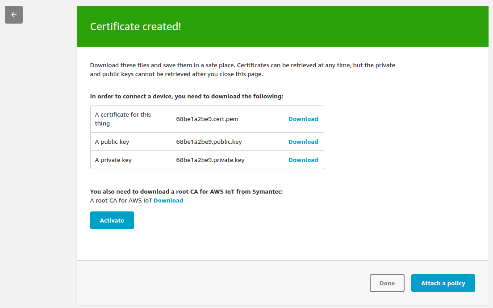

From this page, download all 4 certificates and save them into the `rpi` folder
within your local copy of this repository. When downloading the root CA certificate,
be sure to name it `root-CA.crt`. Your folder should then look like the following:

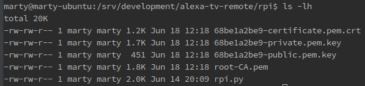

By default, the `rpi.py` script expects `root-CA.crt`, `private.pem.key` and `client.crt`,
so we will rename our certificates to meet those file names.

```
$ cd rpi
$ mv 68be1a2be9-certificate.pem.crt client.crt
$ mv 68be1a2be9-private.pem.key private.pem.key
```

We will be using those certificates shortly. Back in the AWS Console, click on the 'Active' button then
click the 'Attach a Policy' button and select the `alexa-tv-remote-....` policy 
which the CloudFormation template created earlier. Click the 'Done' button once selected.

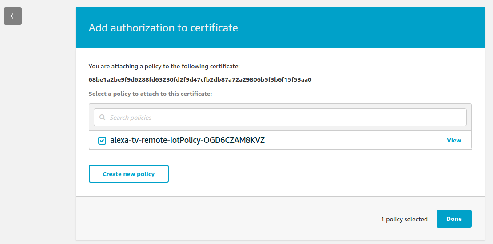

Great! That's all that's needed in the AWS IOT console, we will test out
the certificates in the RPi section below.

### Alexa

To create an Alexa skill, log into the [AWS Develop Console](https://developer.amazon.com/edw/home.html#/skills)
and be sure to click on the 'Alexa' tab then 'Alexa Skills Kit'. Next, click
on 'Add new Skill'.

Fill in the fields as below:

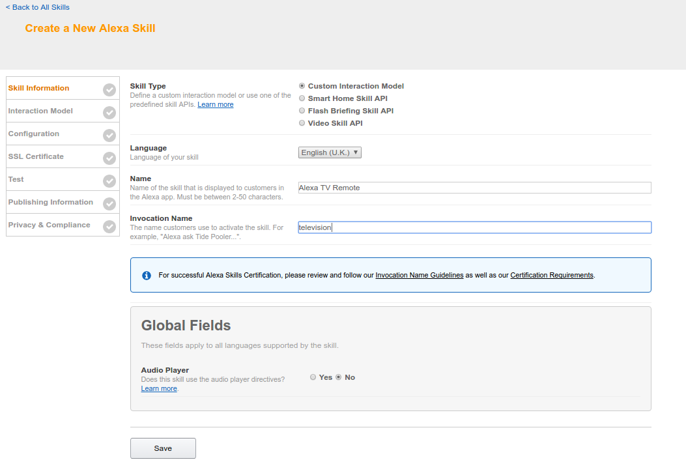

Click save, next launch the beta 'Skill Builder'

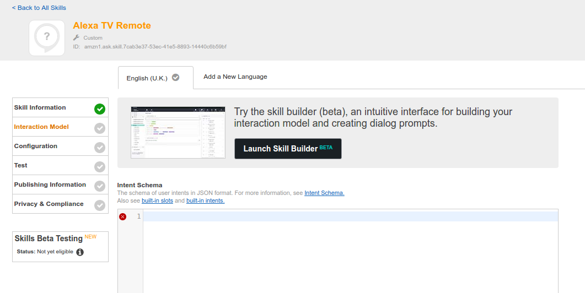

Click on 'Code Editor', then drag and drop the `alexa/ask.json` file 
into your browser. Click 'Apply Changes', 'Save Model' then 'Build Model'.


Once the model has successfully built, click 'Configuration'.
Populate the Lambda invocation ARN with the Lambda functions ARN we created
earlier and click 'Next'.

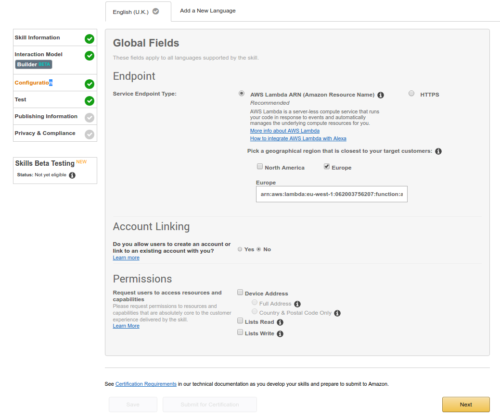


Great! Our Alexa skill is setup! Let's run a quick test in the next
section to ensure everything is working as expected.

#### Testing Alexa -> Lambda -> IOT

First, pop back to the AWS IOT console and open the ['Test' section](https://eu-west-1.console.aws.amazon.com/iotv2/home?region=eu-west-1#/test).
From here we can subscribe to topics to check the Lambda function is 
outputting data which is going to be consumed by the RapsberryPi.
Enter `alexa-tv-remote` and click 'Subscribe to Topic'. Click on the
topic to the left to see the stream.

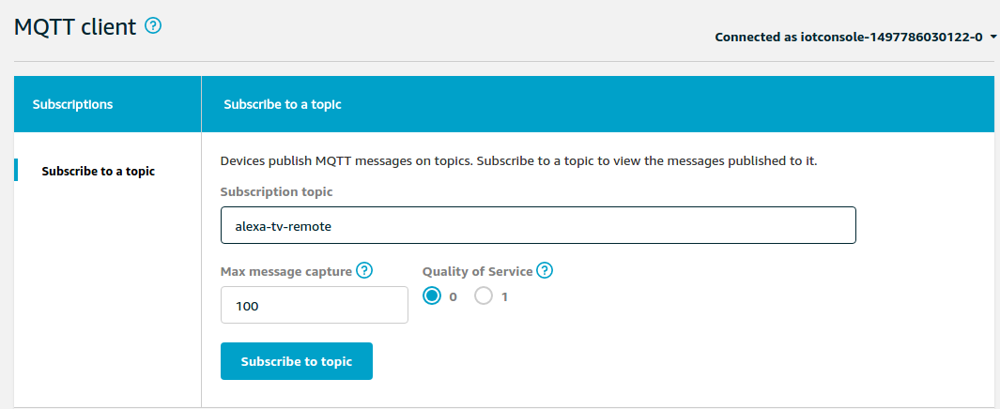

Next, we are going to use the Alexa similator to invocate the lambda
fucntion which will push a message into the IOT topic. Pop back
to the Alexa testing panel and enter the following phrase "change 
channel to BBC News" before clicking 'Ask Alexa TV Remote'.

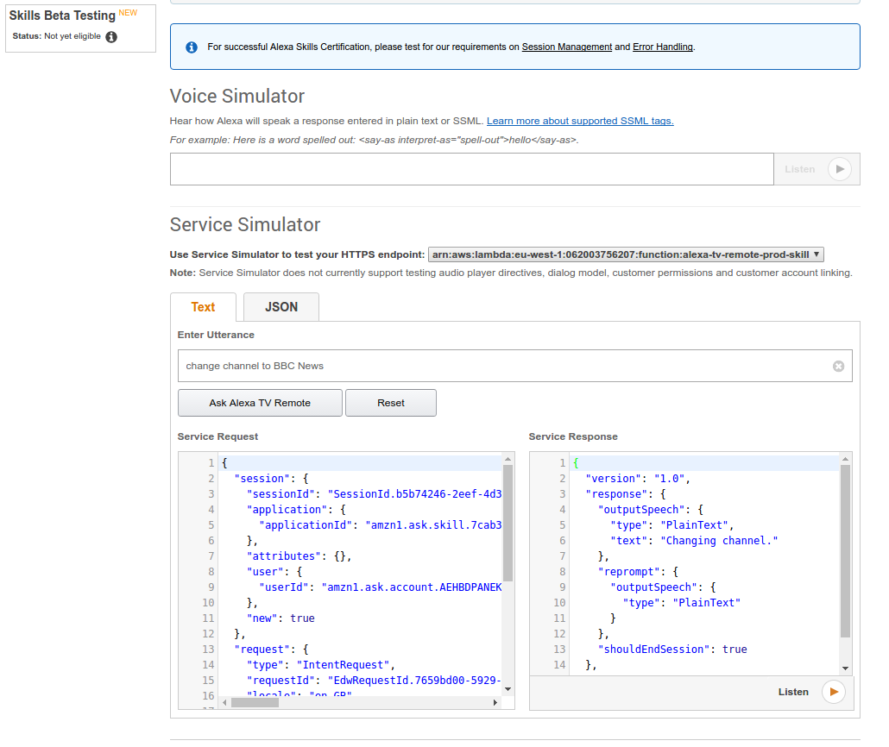
 
 
If all has gone well, you should see the following message on the IOT Topic!
 
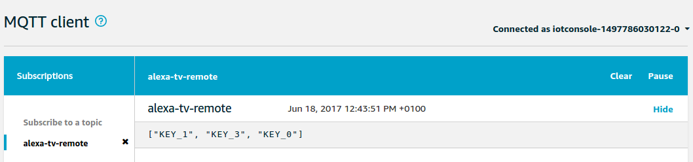
 
This array is going to tell the RapsberryPi to send infrared signals for
KEY_1, KEY_3 then KEY_0 in sequence, changing channel to 130, which is 
BBC News on Freeview.


### RPi

To setup the hardware for your RapsberryPi, use the following tutorial
http://www.raspberry-pi-geek.com/Archive/2015/10/Raspberry-Pi-IR-remote.

Note additionally you may need to add the following to your `/boot/config.txt` file,
where the GPIO pin matches the one you will be using then reboot.
```
dtoverlay=lirc-rpi,gpio_out_pin=5
```

You can test the setup has worked by manually invoking LIRC using the `irsend` command.

Next, if you are working on another machine, copy your `rpi` folder onto your RPi along
with all the certificates created earlier.

```
pi@raspberrypi:~ $ mkdir alexa-tv-remote
user@desktop:PROJECTPATH $ scp rpi/* pi@rpi-ip-address:~/alexa-tv-remote/
pi@raspberrypi:~ $ cd alexa-tv-remote && ls -lh
-rw-r--r-- 1 pi pi  451 Jun 18 11:56 68be1a2be9-public.pem.key
-rw-r--r-- 1 pi pi 1.2K Jun 18 11:56 client.crt
-rw-r--r-- 1 pi pi 1.7K Jun 18 11:56 private.pem.key
-rw-r--r-- 1 pi pi 1.8K Jun 18 11:56 root-CA.crt
-rw-r--r-- 1 pi pi 2.0K Jun 18 11:56 rpi.py

```

Next, install the `AWSIotPythonSDK` onto the RPI.

```
pi@raspberrypi:~/alexa-tv-remote $ pip install AWSIoTPythonSDK -t .
Downloading/unpacking AWSIoTPythonSDK
  Downloading AWSIoTPythonSDK-1.1.1.tar.gz (55kB): 55kB downloaded
  Running setup.py (path:/tmp/pip-build-0TSMsZ/AWSIoTPythonSDK/setup.py) egg_info for package AWSIoTPythonSDK
    
Installing collected packages: AWSIoTPythonSDK
  Running setup.py install for AWSIoTPythonSDK
    
Successfully installed AWSIoTPythonSDK
Cleaning up...
```

Now lets run it! Once it's running, use the Alexa development portal
to resend the test request to made above. If all goes well, you should 
see the message be received and your TV should change channel!

```
pi@raspberrypi:~/alexa-tv-remote $ python rpi.py 
2017-06-18 12:01:14,655 - AWSIoTPythonSDK.core.protocol.mqttCore - DEBUG - Paho MQTT Client init.
2017-06-18 12:01:14,658 - AWSIoTPythonSDK.core.protocol.mqttCore - INFO - ClientID: alexa-tv-remote-device
2017-06-18 12:01:14,659 - AWSIoTPythonSDK.core.protocol.mqttCore - INFO - Protocol: MQTTv3.1.1
2017-06-18 12:01:14,663 - AWSIoTPythonSDK.core.protocol.mqttCore - DEBUG - Register Paho MQTT Client callbacks.
2017-06-18 12:01:14,667 - AWSIoTPythonSDK.core.protocol.mqttCore - DEBUG - mqttCore init.
2017-06-18 12:01:14,670 - AWSIoTPythonSDK.core.protocol.mqttCore - DEBUG - Load CAFile from: root-CA.crt
2017-06-18 12:01:14,674 - AWSIoTPythonSDK.core.protocol.mqttCore - DEBUG - Load Key from: private.pem.key
2017-06-18 12:01:14,677 - AWSIoTPythonSDK.core.protocol.mqttCore - DEBUG - Load Cert from: client.crt
2017-06-18 12:01:14,681 - AWSIoTPythonSDK.core.protocol.mqttCore - DEBUG - Custom setting for backoff timing: baseReconnectTime = 1 sec
2017-06-18 12:01:14,684 - AWSIoTPythonSDK.core.protocol.mqttCore - DEBUG - Custom setting for backoff timing: maximumReconnectTime = 32 sec
2017-06-18 12:01:14,687 - AWSIoTPythonSDK.core.protocol.mqttCore - DEBUG - Custom setting for backoff timing: minimumConnectTime = 20 sec
2017-06-18 12:01:14,691 - AWSIoTPythonSDK.core.protocol.mqttCore - DEBUG - Custom setting for publish queueing: queueSize = -1
2017-06-18 12:01:14,694 - AWSIoTPythonSDK.core.protocol.mqttCore - DEBUG - Custom setting for publish queueing: dropBehavior = Drop Newest
2017-06-18 12:01:14,698 - AWSIoTPythonSDK.core.protocol.mqttCore - DEBUG - Custom setting for draining interval: 0.5 sec
2017-06-18 12:01:14,701 - AWSIoTPythonSDK.core.protocol.mqttCore - DEBUG - Set maximum connect/disconnect timeout to be 10 second.
2017-06-18 12:01:14,705 - AWSIoTPythonSDK.core.protocol.mqttCore - DEBUG - Set maximum MQTT operation timeout to be 5 second
2017-06-18 12:01:14,709 - AWSIoTPythonSDK.core.protocol.mqttCore - INFO - Connection type: TLSv1.2 Mutual Authentication
2017-06-18 12:01:15,270 - AWSIoTPythonSDK.core.protocol.mqttCore - DEBUG - Connect result code 0
2017-06-18 12:01:15,272 - AWSIoTPythonSDK.core.protocol.mqttCore - INFO - Connected to AWS IoT.
2017-06-18 12:01:15,276 - AWSIoTPythonSDK.core.protocol.mqttCore - DEBUG - Connect time consumption: 60.0ms.
2017-06-18 12:01:15,283 - AWSIoTPythonSDK.core.protocol.mqttCore - DEBUG - Started a subscribe request 1
2017-06-18 12:01:15,330 - AWSIoTPythonSDK.core.protocol.mqttCore - DEBUG - _resubscribeCount: -1
2017-06-18 12:01:15,332 - AWSIoTPythonSDK.core.protocol.mqttCore - DEBUG - Subscribe request 1 sent.
2017-06-18 12:01:15,342 - AWSIoTPythonSDK.core.protocol.mqttCore - DEBUG - Subscribe request 1 succeeded. Time consumption: 50.0ms.
2017-06-18 12:01:15,344 - AWSIoTPythonSDK.core.protocol.mqttCore - DEBUG - Recover subscribe context for the next request: subscribeSent: False
Received a new message: 
["KEY_1", "KEY_3", "KEY_0"]
from topic: 
alexa-tv-remote
--------------
```

You will now be able in invoke you skill using the following methods, 
and the request will get through to your RapsberryPi.

- Alexa, ask television to change channel to channel 4
- Alexa, ask television to change channel to Quest
- Alexa, open television
  - change channel to channel 4
  
Feel free to experiment within the Skill Builder to improve the 
interface in which you can interact with the Alexa skill!


## Questions

If you have any questions, open an issue with as much information as possible.
Be sure to obscure any private/secret information, such as your deployment keys and
account id.